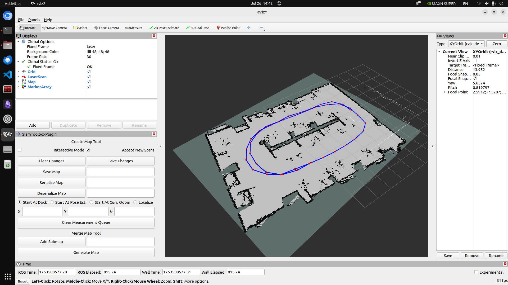

202507261512
# slam-toolbox error fixed
After [slam first try](07.25%20slam-first%20try.md), debugged what was the problem.
The problem was flipped odometry. When vehicle turn right, from rviz it showed turning left.
**Problem detected! How to solve?** 
By [F1Tenth Build page](https://roboracer.ai/build)/Driving the RoboRacer Car/Calibrating the Odometry. When Odom topic publishing negative, we can simply fix it by add '-' sign at the code. 
`/f1tenth_ws/src/f1tenth_system/vesc/vesc_ackermann/src/vesc_to_odom.cpp`   
`double current_speed = -(-state->state.speed - speed_to_erpm_offset_) / speed_to_erpm_gain_;`  
This '-' front of (-state->state.speed) solved the problem.

---
## References